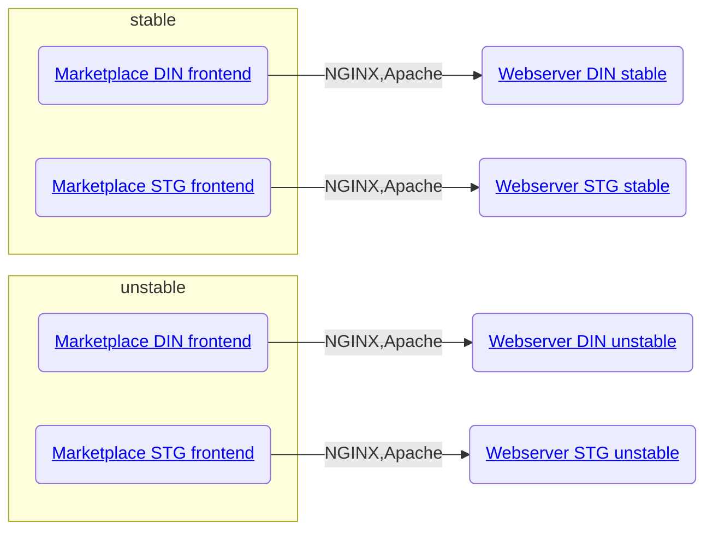
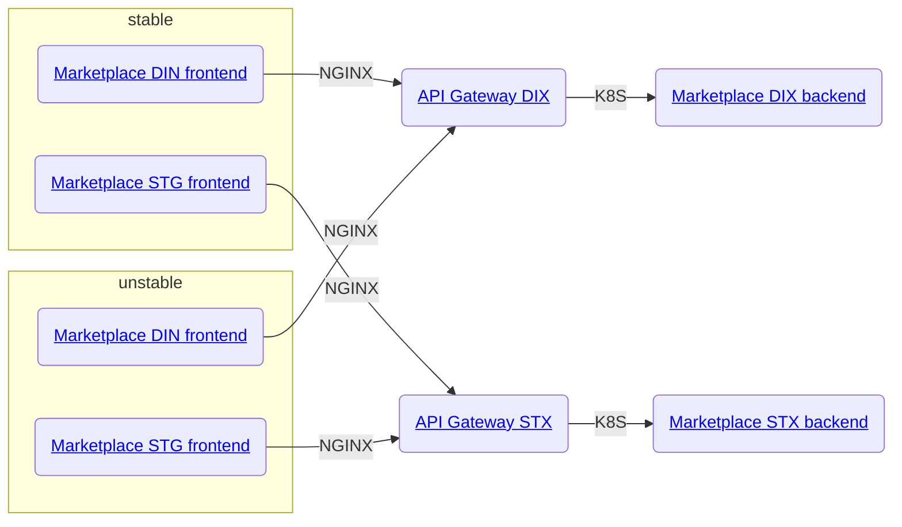

# Marketplace Front

Frontend (static web files) for Marketplace v2.
Built with VueJS, Typescript, Gridsome, Bulma.

> This application requires [marketplace-back](https://gitlab.luxhub.local/dev-luxhub/marketplace-back) as a runtime backend.

- [Marketplace Front](#marketplace-front)
  * [How to start the application](#how-to-start-the-application)
  * [Dependencies](#dependencies)
    + [Technologies](#technologies)
    + [Projects](#projects)
    + [Runtime](#runtime)
  * [CI/CD](#ci-cd)
    + [Jenkins](#jenkins)
    + [Quality](#quality)
    + [Deployment](#deployment)
      - [Application environments](#application-environments)
      - [Published artifacts](#published-artifacts)
      - [Details](#details)
  * [Local development](#local-development)
    + [NodeJS / NPM](#nodejs---npm)
    + [Jenkinsfile](#jenkinsfile)

## How to start the application

1. First you need to execute: `npm install`
2. Then `npm run prepare`
3. Then `npm run develop`
4. Point your browser to `http://localhost:8081`
5. Login with 

## Dependencies

### Technologies

- NodeJS 14+
- npm 6+
- JRE 8+

### Projects

- VueJS 2.x
- Typescript 4+
- Gridsome 0.7.x
- Bulma 0.9.x via Buefy
  (see also [package.json](package.json))

### Runtime

- [marketplace-back](https://gitlab.luxhub.local/dev-luxhub/marketplace-back)

## CI/CD

### Jenkins

| Pipeline                                                                                                                 | Purpose                                                     | State                                                                                         |
| ------------------------------------------------------------------------------------------------------------------------ | ----------------------------------------------------------- | --------------------------------------------------------------------------------------------- |
| [Marketplace-Frontend-Auto](https://jenkins.luxhub.local:8443/view/Agora/job/Marketplace-Frontend-Auto/)                 | Automatic trigger on each push   (mail on failure)       | (multi-branch)                                                                                |
| [Marketplace-Frontend-BuildRelease](https://jenkins.luxhub.local:8443/view/Agora/job/Marketplace-Frontend-BuildRelease/) | Build and release in Nexus   (zip with static web files) |  |
| [Marketplace-Frontend-Deploy](https://jenkins.luxhub.local:8443/view/Agora/job/Marketplace-Frontend-Deploy/)             | Deploy webapp   (use versioned zip from Nexus)           |        |

### Quality

Non-blocking `QA` checks stage are present on [AutoJenkinsfile](AutoJenkinsfile) and [BuildJenkinsfile](AutoJenkinsfile).
In case of failure, the whole build is not set to failed but instead set as `UNSTABLE`.

_Pipelines execute these 3 checks:_

1. `npm audit --audit-level=high`
2. `npm run lint`
3. `npm run test`

- [Sonar report](https://sonar.kube-dev.luxhub.local/dashboard?id=com.luxhub.agora%3Amarketplace-front)

| Indicators                                                                                                                                                                                                                                                                                                                                                                                                          | Sizing                                                                                                                                                                                                                                                                              | Ratings                                                                                                                                                                                                                                                                                                                                                                                                                           | Issues                                                                                                                                                                                                                                                                                                                                                                                                             |
| ------------------------------------------------------------------------------------------------------------------------------------------------------------------------------------------------------------------------------------------------------------------------------------------------------------------------------------------------------------------------------------------------------------------- | ----------------------------------------------------------------------------------------------------------------------------------------------------------------------------------------------------------------------------------------------------------------------------------- | --------------------------------------------------------------------------------------------------------------------------------------------------------------------------------------------------------------------------------------------------------------------------------------------------------------------------------------------------------------------------------------------------------------------------------- | ------------------------------------------------------------------------------------------------------------------------------------------------------------------------------------------------------------------------------------------------------------------------------------------------------------------------------------------------------------------------------------------------------------------ |
|        |     |        |        |

- [Vulnerabilities report on Sonar](https://sonar.kube-dev.luxhub.local/project/extension/dependencycheck/report_page?id=com.luxhub.agora%3Amarketplace-front&qualifier=TRK)

### Deployment

#### Application environments

_Deployed components diagram: static web files_

NGINX first grabs the calls from vhosts then proxies to **port1-dev** and **port2-dev** Apache HTTPD servers.

_Deployed components diagram: APIs_

NGINX first grabs the calls from vhosts then proxies to Axway API Gateway witch itself proxies Marketplace backend.

_Stable environments of the frontend:_
- [Marketplace DIN - https://marketplace-din-stable.luxhub.local/](https://marketplace-din-stable.luxhub.local/)
- [Marketplace STG - https://marketplace-stg-stable.luxhub.local/](https://marketplace-stg-stable.luxhub.local/)

_Unstable environments of the frontend:_
- [Marketplace DIN - https://marketplace-din-unstable.luxhub.local/](https://marketplace-din-unstable.luxhub.local/)
- [Marketplace STG - https://marketplace-stg-unstable.luxhub.local/](https://marketplace-stg-unstable.luxhub.local/)

#### Published artifacts

- [Snapshots](https://nexus.luxhub.local:9443/#browse/browse:maven-snapshots:com%2Fluxhub%2Fagora%2Fmarketplace-front)
- [Releases](https://nexus.luxhub.local:9443/#browse/browse:maven-releases:com%2Fluxhub%2Fagora%2Fmarketplace-front)

#### Details

We archive static web files into a zip file published on Nexus by [Marketplace-Frontend-Auto](https://jenkins.luxhub.local:8443/view/Agora/job/Marketplace-Frontend-Auto/).
On deployment, they are exploded and stored in a frontend server (not in the cluster) and served by an Apache `httpd` properly configured sur such a rich JavaScript application (including deeplink support).

> Marketplace Front deploys into `port1-dev.luxhub.local` and `port2-dev.luxhub.local`
> (accessible using ssh through `jump-dev.luxhub.local`).

_There are currently 4 instances:_

| Environment  | Marketplace-front URL                          | Actual files location                            |
| ------------ | ---------------------------------------------- | ------------------------------------------------ |
| DEV Unstable | https://marketplace-din-unstable.luxhub.local/ | port2-dev:/opt/axway/apiportal/htdoc_mktp_dindix |
| DEV Stable   | https://marketplace-din-stable.luxhub.local/   | port1-dev:/opt/axway/apiportal/htdoc_mktp_dindix |
| STG Unstable | https://marketplace-stg-unstable.luxhub.local/ | port2-dev:/opt/axway/apiportal/htdoc_mktp_stgstx |
| STG Stable   | https://marketplace-stg-stable.luxhub.local/   | port1-dev:/opt/axway/apiportal/htdoc_mktp_stgstx |

[Apache httpd server configuration details](doc/apache-config.md)

## Local development

### NodeJS / NPM

Get latest version of npm (not LTS).
Add the path of npm into your Windows environment variables.

> If you have issues with dependencies, you can delete the folder `node_modules` and run again `npm install`.
> All the command `npm run xxx` can be found in the file [package.json](package.json) (scripts section).

### Jenkinsfile

> Those tips are applicable only on IntelliJ IDEA.

This project makes use of several Jenkinsfile that you may want to maintain.
Jenkinsfile (both scripted and declarative) are Groovy DSLs.
To better work in these files with IntelliJ (syntax highlighting and completion) you can do two things:

1. Enable Groovy syntax support

- Go to "File" > "Settings..." and look for "File Types"
- Add the various Jenkinsfile names:
  

2. Declare keywords available on our Jenkins pipelines

- Notice the file [doc/jenkinsfile.gdsl](doc/jenkinsfile.gdsl)
- Mark the containing directory as source: "Mark Directory as" > "Sources root"
