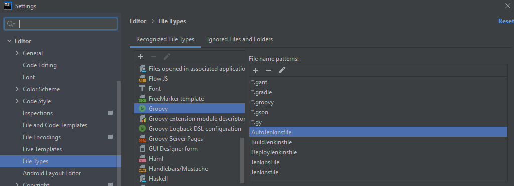

# Agora Front

Frontend (static web files) for the new Marketplace v2. Built with VueJS, Typescript, Gridsome, Bulma.

> This application requires **marketplace-back** as a runtime backend.

## How to start the application

1. First you need to execute: ``npm install``
2. Then ``npm run develop``
3. Point your browser to `http://localhost:8080`

## Dependencies

### Technologies

- JDK 11
- NodeJS 14+
- npm 6+

### Projects

- VueJS 2.x
- Typescript 4+
- Gridsome 0.7.x
- Bulma 0.9.x via Buefy
(see also [package.json](package.json))

### Runtime

- [marketplace-back](https://gitlab.luxhub.local/dev-luxhub/marketplace-back)

## CI/CD

### Jenkins

| Pipeline | Purpose | State |
| -------- | ------- | ------ |
| [Marketplace-Frontend-BuildRelease](https://jenkins.luxhub.local:8443/view/Agora/job/Marketplace-Frontend-BuildRelease/) | Build or release in nexus   (zip with static web files) |  |
| [Marketplace-Frontend-Auto](https://jenkins.luxhub.local:8443/view/Agora/job/Marketplace-Frontend-Auto/) | Automatic trigger on each push | (multi-branch) |

### Quality

TODO...

- [Sonar report](https://sonar.kube-dev.luxhub.local/dashboard?id=com.luxhub.agora%3Aagora-front)

| Indicators | Sizing | Ratings | Issues |
| ---------- | -------| ------- | ------ |
|        |     |        |        |

- [Anchore report](https://jenkins.luxhub.local:8443/view/Agora/job/Marketplace-Frontend-Auto/lastCompletedBuild/anchore-results/)

### Deployment

Static web files are archived into a zip file published on Nexus by [Marketplace-Frontend-Auto](https://jenkins.luxhub.local:8443/view/Agora/job/Marketplace-Frontend-Auto/).
On deployment, they are exploded and stored in a frontend server (not in the cluster) and served by an Apache ``httpd`` properly configured sur such a rich JavaScript application (including deeplink support).

TODO actual deployment...

## Local development

### NodeJS / NPM

Get latest version of npm (not LTS). 
Add the path of npm into your Windows environment variables.

> If you have issues with dependencies, you can delete the folder ``node_modules`` and run again ``npm install``.
> All the command ``npm run xxx`` can be found in the file [package.json](package.json) (scripts section).

### Jenkinsfile

> Those tips are applicable only on IntelliJ IDEA.

This project makes use of several Jenkinsfile that you may want to maintain.
Jenkinsfile (both scripted and declarative) are Groovy DSLs.
To better work in these files with IntelliJ (syntax highlighting and completion) you can do two things:

1. Enable Groovy syntax support

- Go to "File" > "Settings..." and look for "File Types"
- Add the various Jenkinsfile names:

2. Declare keywords available on our Jenkins pipelines

- Notice the file [doc/jenkinsfile.gdsl](doc/jenkinsfile.gdsl)
- Mark the containing directory as source: "Mark Directory as" > "Sources root"
